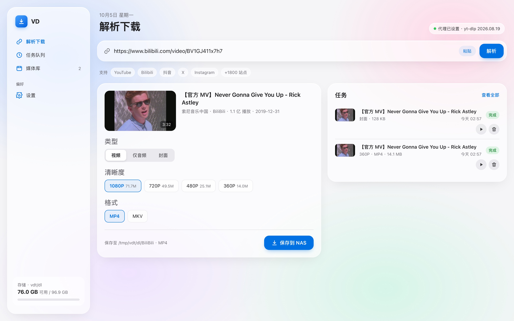
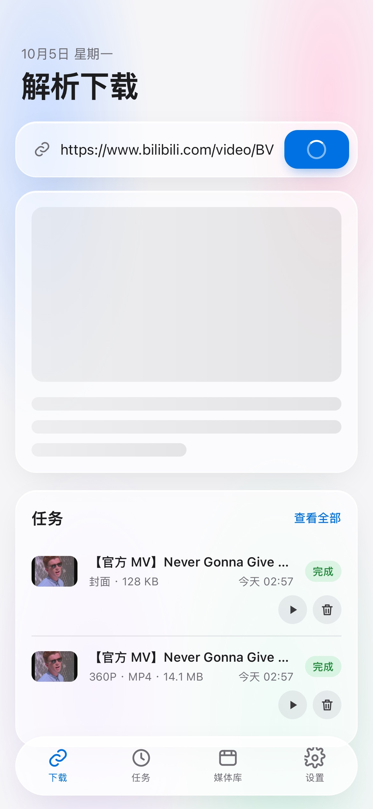

<div align="center">


# VD · 视频下载

**飞牛 fnOS 原生应用 · 粘贴链接，NAS 在后台帮你下载**

[](https://github.com/yiyu12138/VD/releases/latest)
[](https://github.com/yiyu12138/VD/releases/latest)
[](requirements.txt)
[](https://github.com/yt-dlp/yt-dlp)

[功能](#-功能) · [安装](#-安装) · [使用](#-使用) · [常见问题](#-常见问题) · [开发](#-开发与构建) · [更新记录](CHANGELOG.md)

</div>

在局域网任意设备的浏览器里粘贴视频链接，选好清晰度，NAS 会在后台完成下载、音视频合并和归档。关掉网页也不会中断下载。支持 YouTube、哔哩哔哩、抖音、X、Instagram 等 yt-dlp 能解析的 1800+ 个站点。

## ✨ 功能

| 模块 | 说明 |
|---|---|
| **解析下载** | 显示封面、时长、作者、播放量；按清晰度显示预估大小。可选 MP4 / MKV / WebM，或只下音频（MP3 / M4A）或封面。字幕可多选 |
| **任务队列** | 并发数可调（1–6）。支持暂停、继续（断点续传）、取消、全部暂停或继续；实时显示速度和剩余时间；服务重启后任务自动恢复 |
| **媒体库** | 浏览已下载的文件（带封面），可搜索。浏览器里直接播放视频、音频，查看图片，或下载到本机、删除 |
| **网络代理** | 自动检测本机常见代理端口，可一键测试延迟。哔哩哔哩和抖音在代理失败时自动改用直连 |
| **Cookies** | 导入 Netscape 格式的 `cookies.txt`，多个站点自动合并，并列出已登录的站点 |
| **解析器更新** | 在设置页一键更新 yt-dlp，不需要重装应用，应用升级后也会保留 |
| **整理归档** | 按「站点 / 视频标题 /」分文件夹保存，自动附带 `cover.jpg` 封面；同名视频不会覆盖 |
| **界面** | Apple 风格浅色毛玻璃界面。桌面端用侧边栏，手机端用底部标签栏；可以添加到主屏幕当作 App 使用 |

## 📷 界面

<p align="center"> </p>

## 📦 安装

> 需要飞牛 fnOS（x86），并先在 **应用中心** 安装 **Python 3.12**（python312）。fnOS 自带 FFmpeg。

1. 到 [Releases](https://github.com/yiyu12138/VD/releases/latest) 下载 `video-downloader_<版本>_x86.fpk`
2. 打开飞牛 **应用中心 → 右上角「手动安装」**，选择这个 fpk
3. 按向导填写：
   - **访问端口**：默认 `8000`
   - **下载保存目录**：默认 `/vol1/1000/下载/视频下载`
   - **应用数据目录**：用来保存任务记录、设置和 Cookies，保持默认即可
4. 装好后在飞牛桌面点 **视频下载** 图标，或直接访问 `http://飞牛IP:8000`

之后想改端口或目录：**应用中心 → 视频下载 → 应用设置**，保存后服务会自动重启。

### 从旧版 Docker 迁移

v2.0 开始不再提供 Docker 部署。旧容器默认也占用 8000 端口，请先删掉：

```bash
cd /vol1/1000/docker/VD && sudo docker compose down
```

新版沿用同一个下载目录，已下载的文件不受影响。旧版的下载历史存在 Docker 数据卷里，不会迁移过来。

## 🚀 使用

1. 复制视频链接，粘贴到输入框后点 **解析**。可以直接粘贴整段分享文案，会自动提取里面的链接。
2. 选择类型、清晰度、格式和字幕，点 **保存到 NAS**。
3. 在 **任务** 里查看进度；下载完成后可以在 **媒体库** 里直接预览。

**手机小技巧**：用 Safari 打开 VD，点「分享 → 添加到主屏幕」，就能像 App 一样全屏使用。地址里带上 `?url=视频链接` 打开时会自动开始解析，可以配合快捷指令一键发送。

### 代理

**设置 → 网络代理 → 自动检测**，会扫描本机常见代理端口（v2rayA 的 20171/20170、Clash 的 7890 等），也可以手动填写 `http://` 或 `socks5://` 地址。

### Cookies

会员内容、有年龄限制的视频、抖音等都需要登录。在已登录的电脑浏览器里，用「Get cookies.txt LOCALLY」这类扩展导出 `cookies.txt`，再到 **设置 → Cookies** 导入。不同站点可以分多次导入，会自动合并。

> Cookies 等同于登录凭据，请只在受信任的局域网里使用。

## ❓ 常见问题

<details><summary><b>解析失败 / 提示需要登录</b></summary>

先到 **设置 → 关于 → 检查更新** 更新 yt-dlp，站点改版后通常更新一下就能恢复。还不行就导入该站点的 Cookies；海外站点还要确认代理可用（点「测试连接」）。
</details>

<details><summary><b>安装时报「端口已被占用」</b></summary>

一般是旧的 Docker 版还在运行，按上面的迁移步骤删掉；或者在向导里换一个端口。
</details>

<details><summary><b>下载的视频没有声音</b></summary>

合并音视频需要 FFmpeg。fnOS 自带 `/usr/bin/ffmpeg`，可以在 **设置 → 关于** 里确认已检测到。
</details>

<details><summary><b>日志在哪里</b></summary>

`/var/apps/video-downloader/var/app.log`
</details>

## 🛠 开发与构建

```
app/
├── main.py      FastAPI 路由与下载流程
├── worker.py    并发可调的任务队列
├── media.py     yt-dlp 解析 / 下载 / 封面
├── store.py     SQLite：任务、历史、设置
├── system.py    存储空间、版本信息、yt-dlp 在线更新
└── static/      前端（原生 HTML / CSS / JS，无构建步骤）
fpk/             飞牛原生应用包：manifest、向导、生命周期脚本、构建脚本
tools/           图标生成等辅助脚本
```

本地运行：

```bash
python3 -m venv .venv && . .venv/bin/activate
pip install -r requirements.txt
DATA_DIR=./data DOWNLOAD_DIR=./downloads uvicorn app.main:app --reload --port 8000
```

构建 fpk（需要在装了 python312 的飞牛设备上执行，依赖会随包打包，安装时不需要联网）：

```bash
bash fpk/build.sh        # 产物：dist/video-downloader_<版本>_x86.fpk
```

## ⚠️ 注意事项

- 没有登录认证，只适合在受信任的局域网使用，**不要直接暴露到公网**。
- 只下载你有权保存的内容，并遵守各平台的规则。受 DRM 保护的付费内容无法下载。

## 致谢

[yt-dlp](https://github.com/yt-dlp/yt-dlp) · [FFmpeg](https://ffmpeg.org) · [FastAPI](https://fastapi.tiangolo.com)
